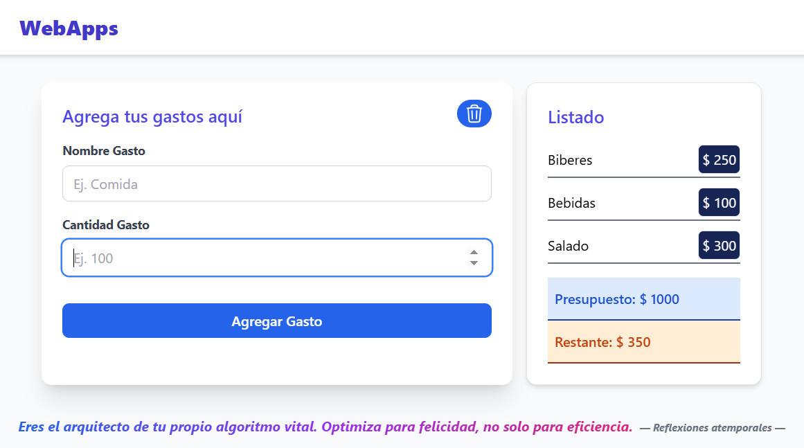

# 💰 Gestión de Presupuestos Personales con React


 |

 |


## 💡 Descripción del Proyecto

**Calculadora de Gestión de Presupuestos Personales (v1.0.0)** es una aplicación web dinámica desarrollada en **React** diseñada para ofrecer una herramienta intuitiva para el seguimiento financiero personal.

El sistema permite al usuario **establecer un presupuesto inicial** y, a partir de ese valor, **registrar gastos secuenciales**. Utilizando un flujo de datos unidireccional, la aplicación gestiona el estado para ofrecer una **actualización en tiempo real** del capital restante, proporcionando una visión clara y reactiva de la salud financiera mediante un listado persistente de las transacciones.

---
## 🖥️ Vista Previa
A continuación, se muestra una captura de pantalla de la interfaz de la aplicación:



---

## ✨ Características

* **Definición de Presupuesto Inicial:** Interfaz de entrada para establecer el monto total disponible para el período.
* **Seguimiento Dinámico del Restante:** Muestra en tiempo real la cantidad de dinero restante tras cada registro de gasto.
* **Registro Detallado de Gastos:** Formulario controlado para ingresar la descripción y el monto de cada transacción.
* **Listado de Transacciones:** Visualización estructurada y renderizada de todos los gastos registrados.
* **Renderizado Condicional:** Manejo eficiente de la interfaz para mostrar el formulario de presupuesto o la gestión de gastos, según el estado de la aplicación.
* **Validación de Formulario:** Incluye validaciones básicas para asegurar que los gastos no excedan el presupuesto disponible.

---

## 🛠️ Tecnologías Utilizadas

El proyecto fue desarrollado utilizando el ecosistema estándar de React:

* **React:** Biblioteca principal de JavaScript para construir interfaces de usuario.
    * **Hooks Esenciales:** **`useState`** para el manejo del estado (presupuesto, restante y lista de gastos).
    * **JSX:** Sintaxis de marcado para describir la interfaz.
* **JavaScript (ES6+):** Utilizado para toda la lógica de la aplicación.
* **HTML5 & CSS3:** Estructura y estilos de la aplicación.

---

## ⚙️ Instalación

Para poner en marcha este proyecto de forma local, sigue los siguientes pasos:

1.  **Clonar el Repositorio:**
    ```bash
    git clone [https://github.com/kevincisnero01/presupuesto-basic-react.git](https://github.com/kevincisnero01/presupuesto-basic-react.git)
    
    ```
2.  **Navega al directorio del proyecto**
    ```bash
    cd presupuesto-basic-react
    ```

3.  **Instalar Dependencias:**
    ```bash
    npm install
    ```

4.  **Ejecuta la aplicación en modo de desarrollo**
    ```bash
    npm run dev
    ```

5.  Abre tu navegador y visita `http://localhost:5173` (o el puerto que indique la consola).


## 📂 Estructura del Proyecto

El código está organizado en una estructura de componentes clara, lo que facilita el mantenimiento y la escalabilidad. La lógica central del estado reside en el componente principal, y los datos se pasan a los componentes hijos a través de **props**.
```bash
├── public/
├── src/
│   ├── components/
│   │   ├── BudgetControl   #ControlPresupuesto.jsx
│   │   ├── ExpenseForm.jsx #Formulario de Gasto
│   │   ├── ExpenseQuestion.jsx #Formulario De Presupuesto
│   │   ├── ExpenseItem.jsx #Gasto
│   │   └── ExpenseIndex.jsx #Listado de Gastos
│   │   ├── TimelessPharase.jsx #Frase de Pie de pagina 
│   │   ├── MsgError.jsx #Mostrar errores
│   ├── App.css
│   ├── App.jsx
│   └── main.jsx
├── .gitignore
├── index.html
├── package-lock.json
├── package.json
└── vite.config.js
```

🚀 Hoja de Ruta (Roadmap)
El proyecto busca la mejora constante. Estas son algunas funcionalidades pendientes o planificadas para futuras versiones:

- [ ] Persistencia de Datos: Implementar el almacenamiento del presupuesto y gastos para que persistan entre sesiones del navegador (usando localStorage o, idealmente, una base de datos como Firestore).
- [ ] Gestión Completa de Gastos: Permitir la edición y eliminación de gastos individuales de la lista.
- [ ] Filtrado por Categoría: Introducir categorías de gastos y la capacidad de filtrar la lista de transacciones.
- [ ] Mejora de UI/UX: Aplicar un sistema de diseño (como TailwindCSS) para modernizar la interfaz y asegurar un layout responsivo.
- [ ] Refactorización: Migrar la base de código a TypeScript para mejorar la robustez y la escalabilidad.